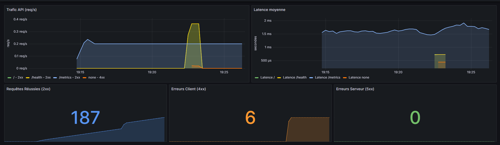

# Automated DevSecOps & Cloud Observability Pipeline

[](https://github.com/adlnkg/aws-devsecops-pipeline/actions)


An end-to-end **DevSecOps** pipeline demonstrating automated infrastructure provisioning, container security scanning, automated deployment, and runtime observability for a containerized **FastAPI** application.

---

## Key Features

* **Infrastructure as Code (IaC):** Automated provisioning of AWS EC2 instances, Security Groups, and SSH key pairs using **Terraform**.
* **Automated CI/CD Pipeline:** Built with **GitHub Actions** to automate unit testing, container image building, artifact pushing to **GitHub Container Registry (GHCR)**, and remote continuous deployment via SSH.
* **Shift-Left DevSecOps:** Integrated container and dependency vulnerability scanning using **Aqua Security Trivy** (blocking builds on critical CVEs).
* **Reverse Proxy:** Production routing and header handling via **Nginx**.
* **Observability Stack:** Metrics collection with **Prometheus** (via `prometheus-fastapi-instrumentator`) and visual monitoring through **Grafana** (traffic, latency, and HTTP status codes).

---

## Architecture Overview

```text
[ Developer Push ]
       │
       ▼
┌────────────────── GitHub Actions (CI/CD) ──────────────────┐
│  1. Unit Tests (Pytest)                                    │
│  2. Security Scan: Trivy (Vulnerabilities & CVE audit)     │
│  3. Docker Build & Push to GHCR (Image Registry)          │
│  4. Automated Continuous Deployment via SSH               │
└──────────────────────────────┬─────────────────────────────┘
                               │
                               ▼
┌─────────────────────── AWS Cloud (IaC via Terraform) ─────┐
│  EC2 Instance (Amazon Linux 2023)                         │
│  ├─ Docker Engine / Docker Compose                        │
│  ├─ Reverse Proxy (Nginx) : Port 80                       │
│  └─ App Container (FastAPI) : Port 8000                   │
└────────────────────────────────────────────────────────────┘
```

---

## Observability & Metrics

A dedicated local monitoring stack is included using Docker Compose to visualize runtime application telemetry.



* **Scraped Metrics:** HTTP request rates (req/s), average processing latency, and distribution of status codes (2xx, 4xx, 5xx).
* **Instrumentation:** Configured via Prometheus metrics endpoint (`/metrics`) integrated natively into FastAPI.

---

## Project Structure

```text
.
├── .github/
│   └── workflows/
│       └── ci.yml                     # CI/CD & Security scanning pipeline
├── api/
│   ├── app.py                         # FastAPI service with Prometheus instrumentation
│   ├── Dockerfile                     # Production container build
│   ├── requirements.txt               # App dependencies
│   └── testApp.py                     # Unit test suite (Pytest)
├── monitoring/
│   └── prometheus/
│       └── prometheus.yml             # Scraping configuration
├── nginx/
│   └── nginx.conf                     # Reverse proxy routing rules
├── terraform/
│   └── main.tf                        # AWS Provider, EC2, Key Pair & Security Groups
├── docker-compose.prod.yml            # Production deployment manifest (GHCR image)
├── docker-compose.local.yml           # Local observability stack (App + Prometheus + Grafana)
├── docker-compose.yml                 # Local reverse-proxy stack (API + Nginx)
└── README.md
```

---

## Getting Started

### 1. Local Development & Observability

Run the application alongside the Prometheus and Grafana stack locally:

```bash
# Start API, Prometheus, and Grafana containers
docker compose -f docker-compose.local.yml up --build -d

# Verify services
curl http://localhost:8000/health
curl http://localhost:8000/metrics
```

* **API Endpoint:** `http://localhost:8000`
* **Prometheus UI:** `http://localhost:9090`
* **Grafana UI:** `http://localhost:3000` *(Default credentials: `admin` / `admin`)*

---

### 2. Infrastructure Provisioning (AWS)

Prerequisites: AWS CLI configured with appropriate credentials.

```bash
cd terraform

# Initialize providers
terraform init

# Review execution plan
terraform plan

# Provision cloud resources
terraform apply
```

To tear down all provisioned cloud infrastructure:

```bash
terraform destroy
```

---

### 3. CI/CD Secrets Configuration

To run the automated deployment pipeline, configure the following secrets in **GitHub Repository Settings > Secrets and variables > Actions**:

| Secret Name | Description |
| :--- | :--- |
| `AWS_EC2_HOST` | Public IP address of the provisioned EC2 instance |
| `AWS_EC2_USER` | Target SSH user (`ec2-user`) |
| `AWS_SSH_KEY` | Private SSH key generated during provisioning |